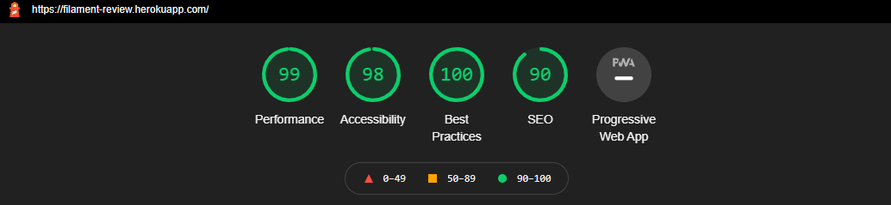

# Filament Review - Milestone 3 Project

[Live link](https://filament-review.herokuapp.com/)

[GitHub Repository](https://github.com/Gilleece/filament-review)


Filament Review is my milestone 2 project. This site is intended to be a community driven resource for reviews of various 3D printer materials. Users can view reviews for the material of their choice, and make an account to upload their own reviews which the can later edit and delete if they want. The site is built using HTML, CSS, Python, Flask and MongoDB. 

# Table of contents
1. [UX](#UX)
    1. [First Time Visitor Goals](#firsttime)
    2. [Returning Visitor Goals](#returning)
2. [Design](#design)
    1. [Colour Scheme](#colour)
    2. [Typography](#typo)
    3. [Layout](#layout)
    4. [Wireframes](#wireframes)
3. [Features](#features)
    1. [Existing Features](#existing)
    2. [Future Features](#future)
4. [Technologies Used](#tech)
5. [Testing](#testing)
    1. [Manual Testing](#manual)
    2. [Automatic Testing](#auto)
    3. [Bugs](#bugs)
    4. [Known Issues](#issues)
6. [Deployment](#deployment)
    1. [Using Heroku](#heroku)
    2. [Building Upon This Project](#building)
7. [Credits](#credits)
8. [Media](#Media)

## UX <a name="UX"></a>

The primary goal with the sites UX, in terms of UI, was to make the site easy to use and look appealing to the type of person that uses 3D printers, hence the graph paper theme to emulate a hobbyist work environment. The website is designed to clearly and simply present data to the user that they will find useful and help them acheive their goal of finding reviews.

### First Time Visitor Goals: <a name="firsttime"></a>
- As a first time visitor I need to be able to navigate the site easily and clearly understand how to use the function of the site.
- I want to be able to see a clear list of materials, along with a description of each material.
- I want to be able to search through reviews.
- I want to find a suitable product for my purposes.

### Returning Visitor Goals: <a name="returning"></a>
- I want to upload my own review.
- I want to edit/delete a review I made.
- I want to look at more reviews.

## Design: <a name="design"></a>

### Colour Scheme: <a name="colour"></a>

- The site's primary colours are blue and white. I ended up really liking the "primary" blue in bootstrap and found it perfect as it was unobtrusive and helped users focus on the content.
- I wanted to deliberately avoid a variety of colour, keeping the site content and information focused. 

### Typography: <a name="typo"></a>
- Site wide, Helvetica Neue is used.

### Layout: <a name="layout"></a>
- The site uses a familiar and intuitive layout.
- Flask is used to present all content, along with flask forms for all forms on the site.

### Wireframes: <a name="wireframes"></a>

- The site's design changed slightly in production but the general idea and layout of the wireframe remains and was used to guide the design of the website as I made it.
- Here is the original wireframe: 


## Features <a name="features"></a>

### Existing Features <a name="existing"></a>
- Responsive on all devices.
- User accounts with passwords properly hashed and cookies for logged in users.
- Log in, log out and register functionality.
- Search Function
- Flask is used for the sites layout.
- Flask forms are used for all forms.
- Users can submit, edit and delete their reviews.
- Explanations of all material types present on the site. 
 

### Future Features <a name="future"></a>
- The reviews could have a like and dislike button, for users to give feedback on reviews and help avoid astroturfing.

## Technologies Used <a name="tech"></a>

1. [HTML:](https://www.w3.org/html/)
    - HTML was used for the content and structure of the site, with emphasis placed on semantic elements and text alternatives for screen readers.
1. [CSS:](https://www.w3.org/Style/CSS/)
    - Bootstrap was used to assist with the responsiveness and styling of the website. 
1. [Python:](https://www.python.org/)
    - All backend was built using Python and Pymongo.
1. [MongoDB:](https://www.mongodb.com/)
    - MongoDB was the database service for the site.
1. [Heroku:](https://www.heroku.com/)
    - Heroku was used to host the site and test it in a live environment.
1. [Bootstrap 5:](https://getbootstrap.com/)
    - Bootstrap was used to assist with the responsiveness and styling of the website.
1. [Font Awesome:](https://fontawesome.com/)
    - Font Awesome was used on all pages throughout the website to add icons for aesthetic and UX purposes.
1. [Flask:](https://flask.palletsprojects.com/en/1.1.x/)
    - This was used for the sites structure and for all forms.
1. [Git](https://git-scm.com/)
    - Git was used for version control by utilizing the Gitpod terminal to commit to Git and Push to GitHub.
1. [GitHub:](https://github.com/)
    - GitHub is used to store the project's code after being pushed from Git.
1. [Balsamiq:](https://balsamiq.com/)
    - Balsamiq was used to create the wireframes during the design process.   
1. [Gitpod:](https://www.gitpod.io/)
    - This was my IDE for the project. 


## Testing <a name="testing"></a>

Testing was carried out both manually and automatically. 

### Manual Testing: <a name="manual"></a>

While building the site I had a preview open in my browser that I would check regularly to ensure that the results were as intended. I made use of developer tools within the browser constantly to check
across a number of things. I would use the console tools to try out different ideas, particularly styling, to see how it worked in real time and then implement the code written there into the project itself.
Responsiveness testing was done both through console tools, along with trying different browsers on different devices. 

My manual testing process was as follows.

#### For each page I performed the following checks:
    * Desktop and mobile
        - Make sure content loads properly, and timely.
        - No errors in console log, or IDE.
        - Try various potential user inputs and search parameters.
        - Try various things like refreshing the page in different sections.
        - Look for results that broke the styling in anyway.
        - Test different scenarios to see if the site continued worked (for example, I would input search parameters that return no results and see if the site continues functioning after this).
        - Emulate different errors like 404 to make sure they were being handled correctly.
    * Mobile only        
        - Try common gestures like pinch to zoom, rotating orientation.     

    All tests were performed across multiple browsers and OS.
            
### Bugs: <a name="bugs"></a>

This is not an exhaustive list but gives examples of some particular bugs that occured and how I fixed them.

#### Bug: Setting the "decade from" caused no results to show up, even though "decade to" worked just fine. "decade from" default also worked just fine.

Solution: Initially I couldn't see any error in the syntax of my code. The test implied that
the "decade from" was causing the error. Eventually I realized that trying 
different dates was causing no issues. It turned out to be a simple error of 
copy/pasting code and not correctly updating it. As a result in my HTML for
the "decade to" selector, it had "from" typed in instead of "value". It was just a
simple error but was a good lesson in remembering to look at the simplest 
issues first instead of trying to change things that I assume to be the 
problem without having any real solid evidence for such assumptions.

#### Bug: Some movie runtimes are input wrong into the api database

Solution: The api that I used, tmdb, relies upon community fed information. For the
most part this is great and enables such a wonderful api but for runtime, some movies get entered in 
incorrectly. For example, a 1hr39min movie may get entered in as just 
39mins due to a typo. My original plan was to allow for movie runtime search to be from 3 
hours down to 30 minutes. However, at these lower times there were often 
feature length movies included in the result. This is unavoidable 
due to not being able to control that aspect of the database. As a result, my 
compromise was to set a 60 minute limit in the code to searchs, and restrict 
search criteria from "any length" to "1.5 hours max". This meant that results 
were accurate. The site was intended for feature length movies, so this
hasn't really impacted the intended purpose of the site whilst also taking
away what would be a very frustrating experience for users.

This was a particularly useful issue in learning the limitations of some APIs and improving my approach towards
using them. 

#### Bug: Api returns certain data in a manner that is not particularly useful to the user.

Solution: The best example of this is the language that is returned for each movie. Rather than returning 
"English", for example, it would return EN. To make the user experience better I utilized a list of language codes,
that I placed into an object, and through this was able to return plain words such as "German" etc instead of a language code. 

#### Bug: Moved recommendation Card from index.html into main.js to dynamically generate it, however the play trailer button is no longer working.

Solution: I originally tested to see if the link being generated was broken, then to see if
the html being generated was broken. I tried removing any dynamically 
generated parts and manually inserting them. Eventually I realized that the
issue was with the snippet of code that controls the autoplay on and off 
feature. It was being executed before the rest of the code related to the play
trailer button. The easiest solution was to simple move it into the same loop
as the other code and the problem was solved. 

#### Bug: Deferred exceptions appearing in the console log for whereToRent and whereToStream

Solution: Although the functionality of the code was unaffected, I kept getting these 
errors in the console. What I realized was that when my code was checking if the selected 
country had choices to rent or stream the movie I was missing a check to see if the selected country was actually being returned by the api call in the 
first place. Putting an additional check for the country fixed this error.


### Known issues: <a name="issues"></a>

Currently, there is one known issue.

#### Known issue: Calling embedded youtube videos, in this case clicking on "Play Trailer" button causes a console log error "GET chrome-extension://invalid/ net::ERR_FAILED".

More details: Searching online shows that this has been going back to 2015, and it seems to be unavoidable. 
It has no impact on functionality and doesn't reference any code in my project (rather it referes to "remote.js:35, on google's side). 

### Automatic Testing: <a name="auto"></a>

[W3C Validator HTML result](assets/readme/w3chtml.png) (Shows no errors).

[W3C Validator CSS result](assets/readme/w3ccss.png) (Shows no errors).

Google Lighthouse results:



## Deployment <a name="deployment"></a>

### Using Heroku: <a name="heroku"></a>

Hosting this project on Heroku required the following: - 
1. Make sure all project keys and secret values are placed in the heroku Config Vars for production.
2. Make sure requirements.txt is up to date with the following command: 	
		```
		pip3 freeze > requirements.txt
		```
3. Set up the Procfile - *A Procfile is required by Heroku .*
4. Set Flask's debugging to False.
5. Push all code to GitHub then use Heroku's GitHub function to deploy from GitHub to the production ready app.


**Upon successful deployment Heroku will give you the URL for your hosted app**

### Building upon this project: <a name="building"></a>

To get set up with a copy of my project you can do these multiple ways. 

**Via GitHub** -  
1. You can manually download locally to your machine and then upload to your preferred IDE. 
2. Install the projects requirements.txt using `pip3 install -r requirements.txt`
3. You will need to update a few environment variables before we can run the app.
	1. `app.config["MONGO_DBNAME"] = "filament_review"`
	2. `app.config["MONGO_URI"] = os.getenv("MONGO_URI", "monogodb://localhost")`
	3. `app.config["SECRET_KEY"] = os.getenv("SECRET_KEY")`
4. Once the above steps are complete you can try run the application using `python3 app.py`

**Via the CLI** -
1. Clone my repo via Git using the following command `https://github.com/Gilleece/filament-review`
2. Install the projects requirements.txt using `pip3 install -r requirements.txt`
3. You will need to update a few environment variables before we can run the app.
	1. `app.config["MONGO_DBNAME"] = "filament_review"`
	2. `app.config["MONGO_URI"] = os.getenv("MONGO_URI", "monogodb://localhost")`
	3. `app.config["SECRET_KEY"] = os.getenv("SECRET_KEY")`
4. Once the above steps are complete you can try run the application using `python3 app.py`

## Credits <a name="credits"></a>
- Thanks to [Reuben Ferrante](https://github.com/arex18), my Code Institute mentor, for his guidance and insight.

- Text examples explaining each filament from www.simplify3d.com

- Thanks to the Code Institute Slack community, it was a great resource for issues.

- Bootstrap, particularly their great documentation.

- W3Schools, for their fantastic explanations and useful examples.

- Flask form tutorial followed: https://blog.miguelgrinberg.com/post/the-flask-mega-tutorial-part-iii-web-forms

- Letter style credit to: https://codepen.io/mlms13/pen/LKFoy
